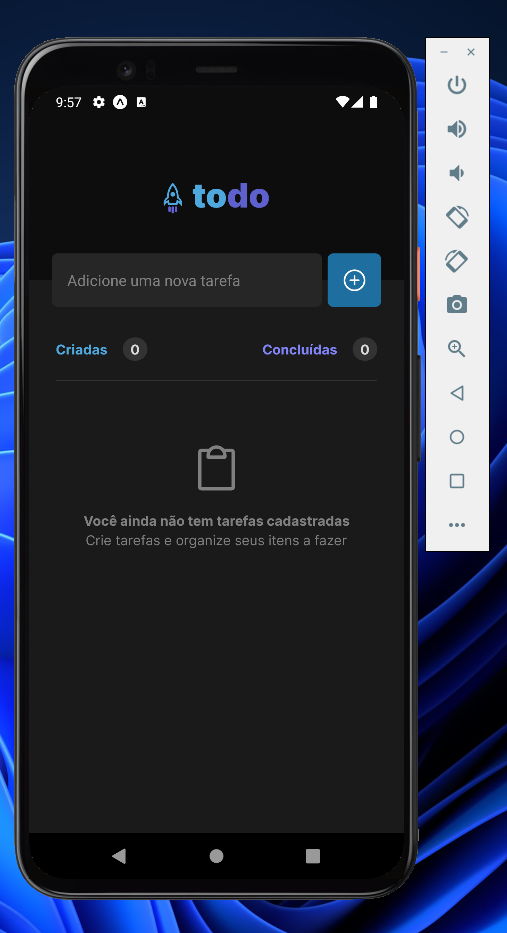
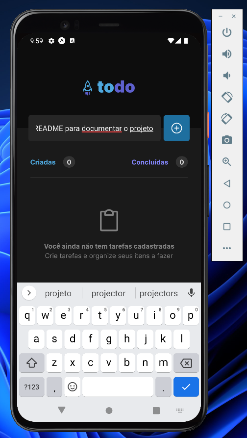
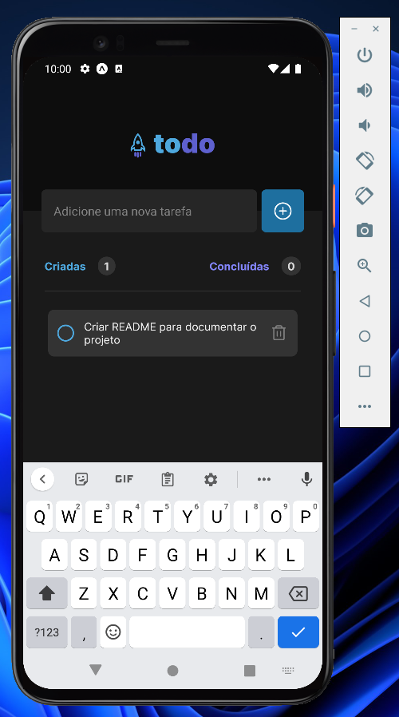
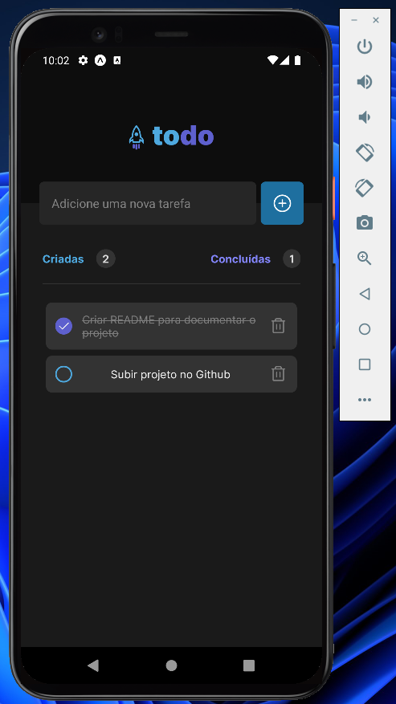

<h1 align="center">
  <a ref="#" alt="">To Do App - ReactNative</a>
</h1>

<h3 align="center">
  Aplicativo de To Do desenvolvido como desafio, dentro da trilha de React Native criado pela RocketSeat 🚀
</h3>

---

## 🎨 Layout

O layout da aplicação está disponível no Figma:

  

  

  

  

---

## 🚀 Como executar o projeto

**Para que esse projeto funcione corretamente, é preciso estar com o servidor rodando.**

- Instale os pacotes com `npm install`.
- Execute `npx expo start` para iniciar o servidor do Expo.

---

### 🛠️ Nesse projeto foi utilizado

As seguintes ferramentas foram usadas na construção do projeto:

* Expo
* Typescript

---
